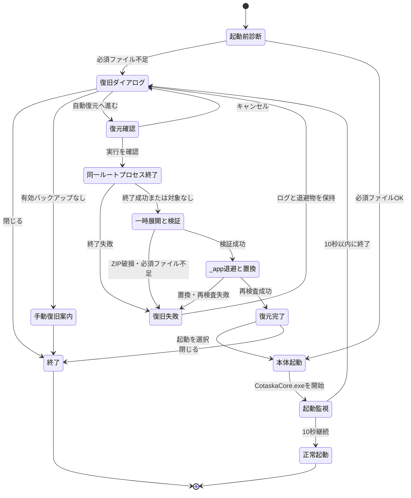

# 99. その他機能

## 1. Cotaska.exe ランチャーの起動診断と確認付き自動復元（CHG-105）

### 1.1 目的と適用範囲

Portable 版のルート直下にある `Cotaska.exe` は、Electron 本体 `_app/CotaskaCore.exe` の起動前診断、起動直後の異常終了検知、および起動不能時の `_app` 専用復旧を担う。

通常起動では利用者へダイアログを表示せず、`CotaskaCore.exe` を起動する。異常を検出した場合だけ、原因、ログ、更新前バックアップ、および確認付き自動復元への導線を提供する。

### 1.2 責務境界

| 区分 | ランチャー復旧（CHG-105） | 設定画面のバックアップ・復元 |
|---|---|---|
| 目的 | アプリ本体の起動不能を復旧する | 利用者データを利用者操作で保全・復元する |
| 復元対象 | `_app/` のみ | タスク、リスト、設定 |
| 復元元 | `backup/portable-update-before-*.zip` | 利用者が選択したデータバックアップ ZIP |
| `data/` | 読み書きしない | バックアップ・復元対象 |
| `logs/`、`backup/` | 読み書き・削除しない。参照・表示のみ | バックアップ保存先として扱う |
| 実行契機 | 起動診断または起動直後の異常終了 | 設定画面での利用者操作 |

ランチャーはルートの `launcher.log` へ診断・復旧操作を追記する。これは `logs/` フォルダーの履歴を変更するものではない。

### 1.3 起動前診断

起動前に `_app/` 配下の次のファイルがすべて存在することを検査する。

- `CotaskaCore.exe`
- `icudtl.dat`
- `resources.pak`
- `snapshot_blob.bin`
- `v8_context_snapshot.bin`

不足が1つでもある場合、アプリ本体は起動しない。欠落したファイル名を `launcher.log` と復旧ダイアログへ記録・表示する。

### 1.4 起動直後の監視

必須ファイルがそろっている場合、ランチャーは `_app/CotaskaCore.exe` を `_app/` を作業ディレクトリとして起動する。起動後 10 秒間はプロセス継続を監視する。

- 10 秒を超えてプロセスが継続した場合は正常起動とみなし、ランチャーを終了する。
- 10 秒以内に終了した場合は異常終了として、終了コードと `_app/debug.log` の最新の `error` または `fatal` 行を復旧ダイアログに表示する。
- ウィンドウの表示有無は診断条件にしない。

### 1.5 復旧ダイアログ

異常時のモーダルダイアログは、検出内容、利用可能な更新前バックアップ、および「自動復元は `_app` のみを対象とし、利用者データを変更しない」ことを表示する。

| 操作 | 動作 |
|---|---|
| 自動復元へ進む | 復元確認を表示する。有効なバックアップがない場合は無効化する。 |
| バックアップを開く | `backup/` フォルダーをエクスプローラーで開く。 |
| エラーログを開く | `launcher.log` と、存在する場合は `_app/debug.log` を既定アプリで開く。 |
| 閉じる | 復元を実行せず終了する。 |

バックアップ候補は、`backup/portable-update-before-*.zip` のうち、ZIP 内の `_app` が必須ファイルをすべて持つ最新ファイルとする。旧 updater が残した同名ディレクトリは互換候補として扱う。候補がない、またはすべて無効な場合は、再配布パッケージからの手動復旧を案内する。

### 1.6 自動復元の状態遷移

### 1.7 確認付き復元と安全策

復元前に、復元元 ZIP、復元対象が `_app` のみであること、`data/`、`logs/`、`backup/` を変更しないことを明示して確認を求める。

同一 Portable ルート配下で実行中の `Cotaska.exe` または `CotaskaCore.exe` がある場合だけ、プロセス名と PID を表示する。利用者が確認した場合だけ終了を試みる。実行ファイルのパスが異なるインストール先の Cotaska プロセスは終了対象にしない。

復元は以下の順序で実行する。

1. ZIP を一時フォルダーへ展開する。旧形式のバックアップディレクトリは一時フォルダーへコピーする。
2. 展開・コピーした `_app` の必須ファイルを検査する。
3. 既存の `_app` を `_app.recovery-before-yyyyMMdd-HHmmss` へリネームして退避する。
4. 検査済みの `_app` だけを Portable ルートへ配置する。
5. 配置後に必須ファイルを再検査する。
6. 成功時は利用者が `Cotaska` を起動できるようにする。

置換または再検査に失敗した場合は、新しい `_app` を除去して退避済みの `_app` を戻す。バックアップ、`data/`、`logs/`、退避物は保持し、失敗理由を `launcher.log` に記録する。

### 1.8 更新前バックアップ

Portable updater は更新対象を置換する前に、`backup/portable-update-before-<timestamp>.zip` を作成する。ZIP には復旧対象の `_app` を含める。これは起動不能時のアプリ本体復旧用であり、利用者データのバックアップとは別のものである。

### 1.9 確認観点

- 必須ファイルがそろう通常起動ではダイアログを表示しない。
- 必須ファイルの欠落時、欠落名とログ・バックアップ導線を表示する。
- 起動後 10 秒以内の終了時、終了コードと最新エラーを表示する。
- 有効な更新前バックアップから `_app` だけを復元し、復元前後で `data/` の内容が変わらない。
- 同一ルートのプロセスだけが確認・終了対象となり、別インストール先のプロセスは対象外となる。
- ZIP破損、必須ファイル不足、ファイルロック時に、既存 `_app`、ログ、バックアップを保持する。
